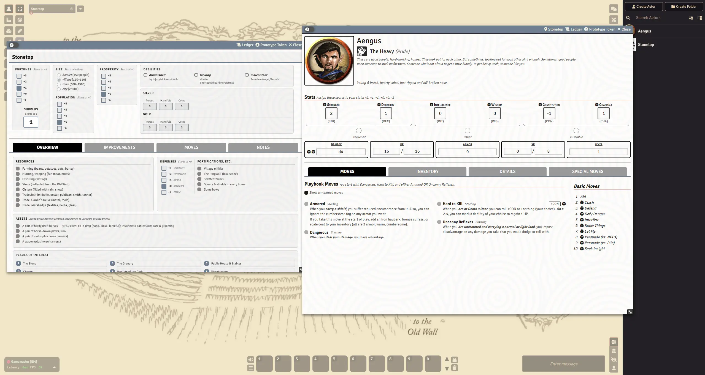
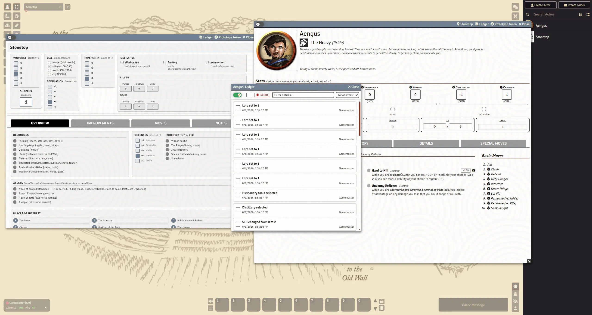
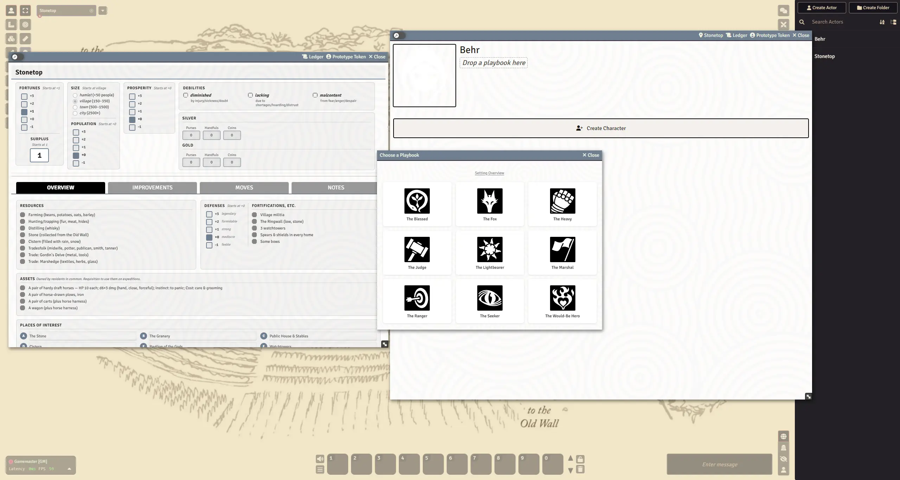

# Stonetop for Foundry VTT

An unofficial [Foundry VTT](https://foundryvtt.com) system for playing [Stonetop](https://plusoneexp.com/collections/stonetop) by Jeremy Strandberg.

> This system is under active development and may be unstable.

## Screenshots


**Character Sheet — Filterable Moves**


**Character & Stonetop Sheet — Ledgers**


**New Character Creation**


## Prerequisites

- Foundry VTT v12 or v13

## Installation

In Foundry VTT, go to **Game Systems -> Install System** and paste this manifest URL:

```
https://github.com/PrinceWitherdick/stonetop/releases/latest/download/system.json
```

## Development

```bash
npm install        # install dev dependencies
npm run pack       # compile JSON source into LevelDB compendium packs
npm run unpack     # extract packs back to JSON source
npm test           # run tests
```

## License

Code is licensed under the [MIT License](LICENSE).

Game content is derived from [Stonetop](https://plusoneexp.com/collections/stonetop) by Jeremy Strandberg and used under [CC BY-SA 4.0](https://creativecommons.org/licenses/by-sa/4.0/).

[Some assets](assets/playbooks/ATTRIBUTION.md) sourced from [game-icons.net](https://github.com/game-icons/icons) are used under [CC BY 3.0](https://creativecommons.org/licenses/by/3.0/).
