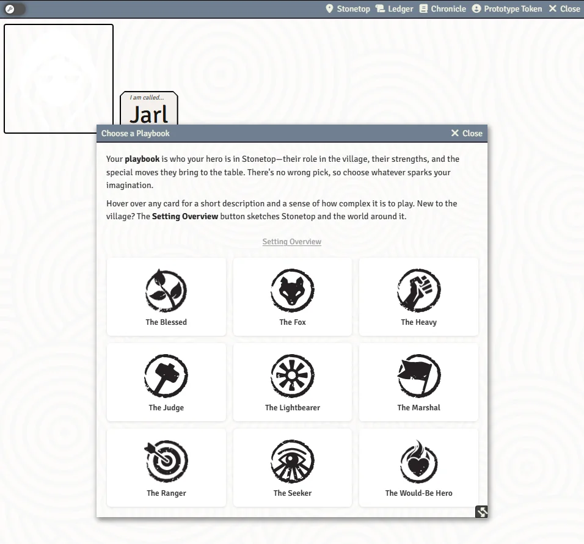
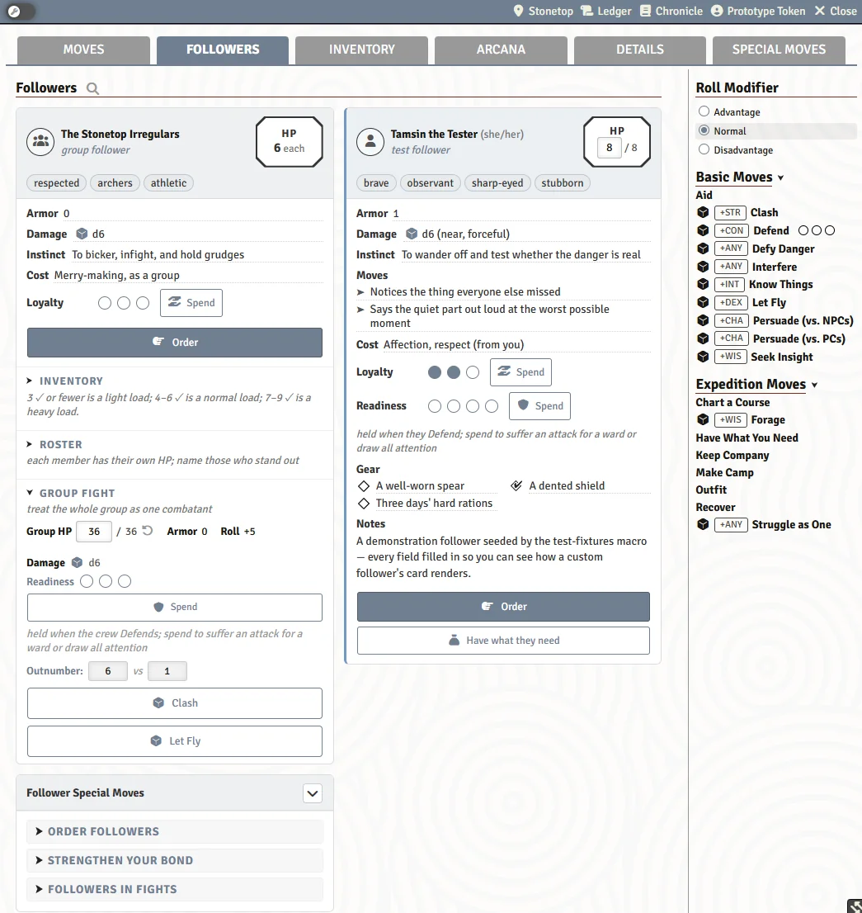
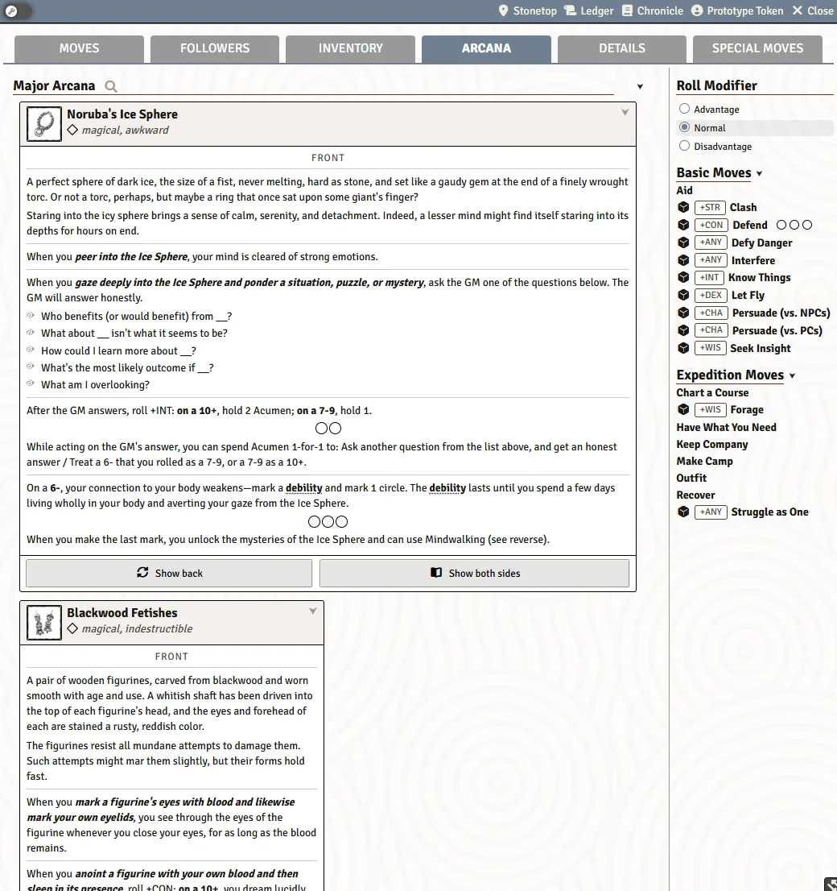
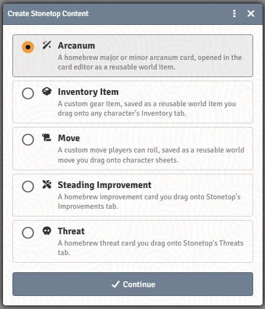
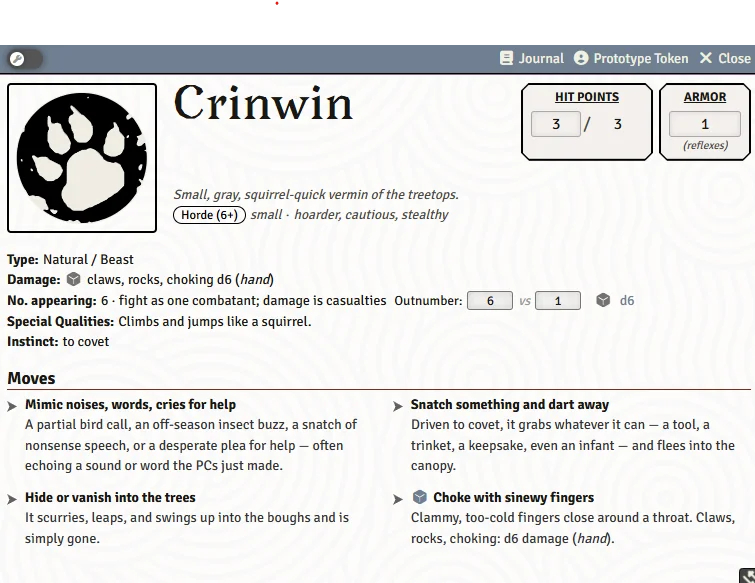

# Stonetop for Foundry VTT

An unofficial [Foundry VTT](https://foundryvtt.com) system for playing [Stonetop](https://plusoneexp.com/collections/stonetop) by Jeremy Strandberg.

> This system is under active development and may be unstable.

## 🤖 Created in collaboration with AI to facilitate rapid development. Absolutely no image generation was or will be used.

## Features

Everything below is built into the system. No extra modules required.

### For Players

#### Guided Character Creation

A multi-step onboarding wizard handles everything from playbook selection to the final starting move. Each playbook's unique setup is fully supported: backgrounds with conditional forms, appearance builders, stat allocation, starting moves and invocations, crew and animal companion configuration, lore questions, and Seeker arcana. Progress is saved so players can pause and return without losing their work.



#### Automated Move Rolls

Every move roll goes through a pre-roll dialog that shows active **Forward** and **Ongoing** modifiers (Forward clears automatically after use), then lets the player choose Normal, Advantage, or Disadvantage, plus an alternate stat for moves that allow one. Results are classified automatically as Strong Hit (10+), Weak Hit (7-9), or Miss (6 and under), the roll card spells out what happens at each tier, and a miss instantly awards +1 XP. Debilities apply disadvantage to the correct stat and annotate the card so the table always knows why.

#### Level-Up Wizard

Clicking Level Up opens a step-by-step wizard. It shows the XP cost, presents every move the character is eligible for (locking moves whose prerequisites aren't met), and, on even levels, surfaces available Invocations. Picking a move that grants a choice (a stat increase, a move borrowed from another playbook, an extra Sacred Pouch trait) opens the matching chooser inline, and the wizard flags when you still have picks left to spend. Confirming applies the new level, deducts XP, and adds the chosen move to the sheet in one click.

#### Interactive Combat

Clash and Let Fly run as a guided flow: choose a target, roll, then resolve damage per target while the GM applies it straight from the chat card. Weapon tags and ranges are baked in, enemies counter-attack when the fiction calls for it, and the whole exchange stays on the card so nobody loses track of who hit whom.

#### Outfit & Inventory Management

The Outfit Move dialog lets players check off items and see their load level update in real time. The system calculates armor automatically from equipped items (base plus modifiers) and tracks pool slots, small-item limits (tied to steading prosperity), and per-item resources like rations and ammo.

#### Followers

Build a follower from scratch with a guided builder, or turn any bestiary monster into a follower in one step. Each follower lives on a single card with per-section editing for instinct, moves, cost, and tags. During play the card handles the follower moves for you: Order rolls, Strengthen Bond, ammo and supply tracks, and a follower's fate at 0 HP. Group warbands, hirelings, and companions to keep the tab tidy.



#### Seeker Arcana

The Seeker's arcana ship as a browsable deck. Cards track their marks, unlocks, and resource tracks interactively, the GM can reveal a whole card (or just its front) to a player once it's discovered, and a per-card ledger records every change so the table can see an arcanum's history at a glance.



#### Per-Tab Search

Each character-sheet tab has a collapsible search box that filters the list in front of you (moves, gear, followers), so long sheets stay navigable.

### For Game Masters

#### Guided First Session

The GM gets a **Welcome** guide and a **Let Spring Burst Forth** walkthrough that frames the village's opening scene step by step, with one-click sharing of the right journals to the table. Players see a guided creation intro and a **resumable** onboarding flow, while the GM watches a live roster fill in as each character is finished. A **New to Foundry?** primer helps first-time Foundry users find their feet.

#### GM Result Controls

After any roll, the GM can shift the result up or down by one tier directly from the chat card (Strong Hit to Weak Hit to Miss, and back) without re-rolling. Characters with the Burn Brightly feature can spend 2 XP from the chat card to bump a recent roll by +1.

#### Steading Sheet & Seasonal Automation

The Stonetop steading sheet tracks Fortunes, Prosperity, Population, and Defense alongside the debility system (Diminished, Lacking, Malcontent). Steading moves are wired up: **Meet with Disaster** auto-applies the Fortunes penalty and picks a consequence; **Seasons Change** steps through the full seasonal checklist with automatic resource updates and nudges each player with a personal upkeep reminder; **Muster** deducts Fortunes before the roll. Completing an improvement automatically applies its one-time effect (reversible if you undo it), Places of Interest can be dragged onto a scene to drop a lettered map note, and a seasonal **Weather** oracle plus an **Expedition** GM walkthrough round out the homefront tools.

#### Threats

A dedicated **Threats** tab collects the GM's threats as book-faithful cards. Threats (and hazards) are pure GM prep, gathered into a single "Stonetop Threats" / "Stonetop Hazards" journal: drag a card onto a scene to drop a pin, and optionally show live threat cards as a canvas overlay.

####  Love Letters

Love Letters hand a single character a personal, one-time GM move in the spirit of Book I's love letters. Each one sits at the top of that character's Moves tab until it's used; one click rolls it, posts the outcome to chat, and consumes it. A Love Letter macro is slotted to the hotbar for quick access.

#### Character Introductions & The Chronicle

The Introductions flow walks the table through the get-acquainted questions during the first session. Answer and ask steps open on the active player's own client while the GM follows along live (no extra setup or sockets), and once everyone has answered, the system compiles **The Chronicle**: a world journal with a page per character plus the Spring Burst opening, ready for the GM to narrate and players to read back.

####  End of Session Macro

An **End of Session** macro is automatically slotted into hotbar slot 10. The GM checks off which of the four group XP criteria were met and the system awards XP to every player-owned character simultaneously, then posts a summary to chat.

#### Homebrew Content Creation

A **Create Content** picker mints your own material as reusable world items: homebrew Arcana, custom Moves players can roll, Inventory Items, Steading Improvements, and Threats. Each one is saved once and then dragged onto the sheet or tab where it belongs, so a table can grow its own deck of moves, gear, and dangers alongside the bundled content.



### Bundled Content

#### Bestiary

The system ships with the full bestiary of Books I and II: around 180 creatures, each with an illustrated codex entry and a ready-to-drop stat block, sorted into 38 regions and tagged by creature type. Monster and codex content stays hidden from players until you reveal it, so it doubles as a spoiler-safe GM reference.



#### Locations & Lore

A bundled **Stonetop** journal compendium covers the wider world: all 30 Book II locations plus the setting's gods and factions, cross-linked to one another and to the bestiary so a click carries you from a region to the creatures that haunt it. Hover any link for a one-line summary. Seeded entries refresh automatically when the system updates, unless you've edited them, in which case your version is left untouched.

## Screenshots


---

## Prerequisites

- Foundry VTT v13 or v14

## Installation

In Foundry VTT, go to **Game Systems -> Install System** and paste this manifest URL:

```
https://github.com/PrinceWitherdick/stonetop/releases/latest/download/system.json
```

## Recommended Modules

- **[Dice So Nice!](https://foundryvtt.com/packages/dice-so-nice)** renders 3D dice rolls on the tabletop. Every move, damage, and steading roll in this system uses Foundry's dice, so Dice So Nice adds a tactile sense of immersion to the table without any extra setup.

## Development

```bash
npm install        # install dev dependencies
npm run pack       # compile JSON source into LevelDB compendium packs
npm run unpack     # extract packs back to JSON source
npm test           # run tests
```

## Credits & Attribution

Stonetop is the work of many hands. Per the credits page in the rulebooks, this system builds on:

- **Written by** Jeremy Strandberg
- **Illustrated by** Lucie Arnoux
- **Arranged (design & layout) by** Jason Lutes
- **Proofread by** Angel Green, Rob Rendell, Matt Wetherbee, John Pham, Steven Quillen, and Dennis Taylor
- **and a legion of volunteers** from the Stonetop community
- **Published by** [Lampblack & Brimstone](https://lampblackandbrimstone.com)

Some concepts and procedures are derived from *Dungeon World* by Sage LaTorra & Adam Koebel, used under a Creative Commons Attribution (CC BY) license.

All of the game's artwork is © Lucie Arnoux. That artwork is **not** open-licensed and is **not** redistributed by this system: the illustrations from Stonetop's books do not ship here. Any art bundled with this system is either our own work or separately licensed (see below).

## License

This system reuses the CC BY-SA 4.0 text and evokes the visual presentation (trade dress) of Stonetop. In keeping with the ShareAlike terms, the game-content portions of this project are released under the same license, with attribution to the creators above.

- **Code** (JavaScript, templates, styles, build tooling) is licensed under the [MIT License](LICENSE).
- **Game content** derived from [Stonetop](https://plusoneexp.com/collections/stonetop) by Jeremy Strandberg, together with any part of this system that reproduces the game's text or evokes its trade dress, is licensed under [CC BY-SA 4.0](https://creativecommons.org/licenses/by-sa/4.0/).
- **Icon assets** sourced from [game-icons.net](https://github.com/game-icons/icons) are used under [CC BY 3.0](https://creativecommons.org/licenses/by/3.0/), with per-icon artist credits in the [playbook](assets/playbooks/ATTRIBUTION.md) and [macro](assets/icons/macros/ATTRIBUTION.md) attribution files.

This is an unofficial, fan-made system, not affiliated with or endorsed by Jeremy Strandberg or Lampblack & Brimstone. Stonetop, its artwork, and its trade dress remain the property of their respective owners.

## AI Training and Data Mining

Rights are reserved for text and data mining, machine learning, and AI training. This project and its release artifacts may not be used to train, fine-tune, or evaluate AI models, or be included in datasets built for those purposes. See the [AI Training and Data-Mining Notice](AI-TRAINING-NOTICE.md), with machine-readable signals in [`ai.txt`](ai.txt), [`.well-known/tdmrep.json`](.well-known/tdmrep.json), and [`robots.txt`](robots.txt).
